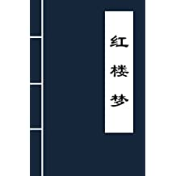

# Dream of the Red Chamber 红楼梦 - Archi Model

Book by Cao Xueqin

| | modeling using |  |
| --- | --- | --- |

《红楼梦》，中国古典四大名著之首，清代作家曹雪芹创作的章回体长篇小说，又名《石头记》《金玉缘》。此书分为120回“程本”和80回“脂本”两种版本系统。

《红楼梦》新版通行本前80回据脂本汇校，后40回据程本汇校，署名“曹雪芹著，无名氏续，程伟元、高鹗整理”。后40回作者尚有争议。

小说以贾、史、王、薛四大家族的兴衰为背景，以贾府的家庭琐事、闺阁闲情为脉络，以贾宝玉、林黛玉、薛宝钗的爱情婚姻故事为主线，刻画了以贾宝玉和金陵十二钗为中心的正邪两赋有情人的人性美和悲剧美。通过家族悲剧、女儿悲剧及主人公的人生悲剧，揭示出封建末世危机。

《红楼梦》是一部具有世界影响力的人情小说作品，举世公认的中国古典小说巅峰之作，中国封建社会的百科全书，传统文化的集大成者